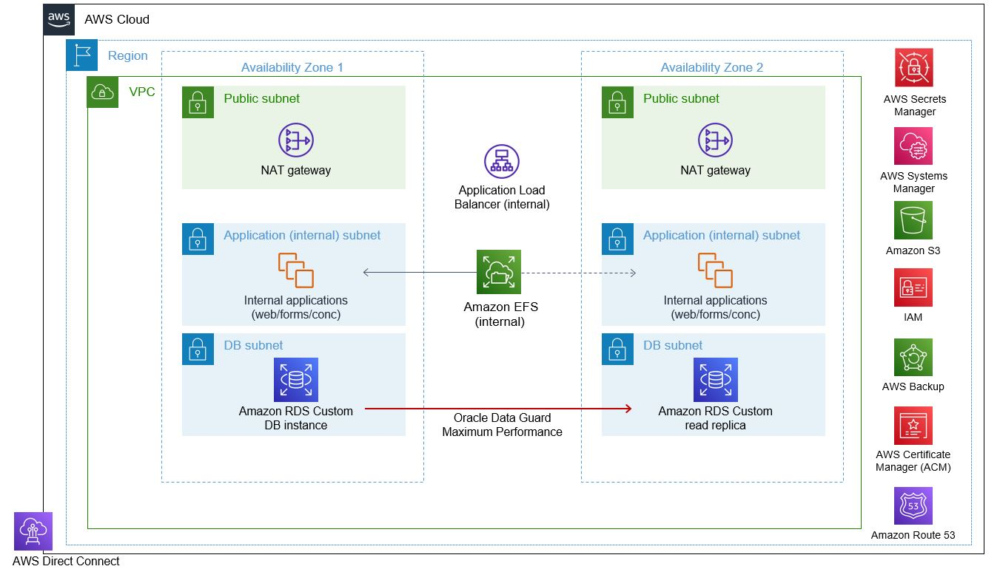

## Automate Oracle E-Business Suite application and database switchover/failover process.

Many Organizations are running Oracle E-Business Suite, which in most cases is considered a core application within the organization. Oracle E-Business Suite is a business application suite that includes financial, supply chain, human resources, and customer relationship management modules. Due to the application’s critical nature, It is imperative to architect Oracle E-Business Suite for high availability and to develop the ability to switchover the application and database as quickly as possible by removing personal dependencies. It is critical for organizations to ensure high availability of Oracle E-Business Suite applications in order to minimize downtime and maintain business continuity. One method for achieving high availability is to perform an EBS application switchover. This document will go over how to perform an Oracle E-Business Suite application and database switchover.

Amazon RDS Custom for Oracle is a managed database service for legacy, custom, and packaged applications that require access to the underlying operating system and database environment. It automates database administration tasks and operations while making it possible for you as a database administrator to access and customize your database environment and operating system.  AWS will take care of the heavy lifting such as backups, high availability allowing database administrators to focus on maintaining their E-Business Suite application and functionality.

Here are some common use cases when an application switchover/failover might be performed:

* During planned maintenance of the primary database and application servers, a switchover to the standby servers can be performed to minimize application downtime.
* In the event that the primary servers' hardware fails, a switchover to the standby servers can be performed to keep the application running.
* To ensure business continuity in the event of a disaster or a major outage, a switchover to the standby server can be performed.
* To avoid downtime during a software upgrade on the primary database server, a switchover to the standby server can be performed.

## Architecture
Acrhitecture diagram of the environments used to develop and test this automation are depicted below.



This project is intended to be sample code only. Not for use in production directly.

This project will create the following in your AWS cloud environment specified:

- AWS IAM Roles
- AWS IAM Policies
- AWS Lamda Functions
- AWS Stepfunction State Machine.

## Prerequisite


1.  A VPC with alteast one private subnet to deploy the automation.
2.  A security group attached to the above VPC with allow all egress rule.
3.  An AWS System Manager Parameter Store to store Oracle E-Business suite environment details

    The naming convention of the primary database should be ATS-<>ENVNAME<>-Nodetab with parameter store type SecureString. For example if the environment name is VIS, then the AWS Parameter Store should be named ATS-VIS-Nodetab

    The values in the AWS Parameter Store should contain the following information in the specified order for both the Primary and Standby environments, as well as for each E-Biz virtual hostname. The values are separated by ‘:’
    EnvName:Primary DB Unique Name:Primary DB EC2 Unique Hostname:Primary App EC2 Unique Hostname:ALB Target Group Name For Primary App EC2 Instances:ALB Name:ALB Listener Port:Application Logical Hostname:Application Base Path:(P)rimary/(S)econdary Application Node:Apps Password:Weblogic Password

    EnvName:Standby DB Unique Name:Standby DB EC2 Unique Hostname:Standby App EC2 Unique Hostname:ALB Target Group Name For Standby App EC2 Instances:ALB Name:ALB Listener Port:Application Logical Hostname:Application Base Path:(P)rimary/(S)econdary Application Node:Apps Password:Weblogic Password

    The following are sample entries for a two-node application server configured with AWS Custom RDS for both primary and standby configuration.

    VIS:VIS_P:EBIZ-P-VIS-DB-AZ1:EBIZ-P-VIS-APP-01:TGP-VIS-PRM:ALB-VIS-PRM:443:EBSAPP01:/fh01/VIS:P:apps:wls123
    VIS:VIS_P:EBIZ-P-VIS-DB-AZ1:EBIZ-P-VIS-APP-01:TGP-VIS-PRM:ALB-VIS-PRM:443:EBSAPP02:/fh01/VIS:S:apps:wls123
    VIS:VIS_S:EBIZ-S-VIS-DB-AZ2:EBIZ-S-VIS-APP-01:TGP-VIS-STBY:ALB-VIS-STBY:443:EBSAPP01:/fh01/VIS:P:apps:wls123
    VIS:VIS_S:EBIZ-S-VIS-DB-AZ2:EBIZ-S-VIS-APP-01:TGP-VIS-STBY:ALB-VIS-STBY:443:EBSAPP02:/fh01/VIS:S:apps:wls123


## Deploying the CDK Project

This project is set up like a standard Python project. For an integrated development environment (IDE), use AWS Cloud9 environment to create python virtual environment for the project with required dependencies.

1. Launch your AWS Cloud9 environment.

2. Clone the github repository and navigate to the directory.

```
$ git clone https://gitlab.aws.dev/ebs_switchover/ats-ebs.git

$ cd ats-ebs
```
To manually create a virtualenv
```
$ python3 -m venv .env
```

After the init process completes and the virtualenv is created, you can use the following step to activate your virtualenv.

```
$ source .env/bin/activate
```
Once the virtualenv is activated, you can install the required dependencies.

```
$ pip install -r requirements.txt

```
The cdk.json file takes the input context for the stack. Update the following context variables in cdk.json before deploying this stack.


- vpc_id : Provide a VPC ID which has alteast one private subnet. This automation will be deployed in that vpc.
- sec_grp_id : Provide a security group id which has allow all egress rule which is attached to the above vpc.

Bootstrap your AWS account for CDK. Please check here for more details on bootstraping for CDK. Bootstraping deploys a CDK toolkit stack to your account and creates a S3 bucket for storing various artifacts. You incur any charges for what the AWS CDK stores in the bucket. Because the AWS CDK does not remove any objects from the bucket, the bucket can accumulate objects as you use the AWS CDK. You can get rid of the bucket by deleting the CDKToolkit stack from your account.

```
$ cdk bootstrap
```

## IMPORTANT: Automation's Environment Assumptions
Read this section thoroughly to ensure that this automation runs smoothly.

* AWS SSM Agent is installed and configured in all the EC2 instances as per the instructions in the link [Working with SSM Agent](https://docs.aws.amazon.com/systems-manager/latest/userguide/ssm-agent.html)
* E-Business Suite running on AWS, with RDS Custom.  See [APG](https://docs.aws.amazon.com/prescriptive-guidance/latest/patterns/migrate-oracle-e-business-suite-to-amazon-rds-custom.html)
* The source database is running on Amazon RDS Custom for Oracle.  Note these steps can be adopted for an Oracle database running on Amazon EC2
* The Application version is E-Business Suite 12.2.x 
* Multiple Oracle E-Business Suite application tiers, across 2 Availability Zones, See [APG](https://docs.aws.amazon.com/prescriptive-guidance/latest/patterns/set-up-an-ha-dr-architecture-for-oracle-e-business-suite-on-amazon-rds-custom-with-an-active-standby-database.html)
* The database OS user is rdsdb, and the application OS user is applmgr. If your environment has a different OS user name, edit the below lambda functions code to reflect the correct OS user.
    
Search and replace the occurences of rdscdb user with your respective database os user 

``` 
    atsobject/lambda/ATS-EBS-SwitchoverDb/lambda_function.py
    atsobject/lambda/ATS-EBS-FetchPrimaryDb/lambda_function.py
    atsobject/lambda/ATS-EBS-StandbyMount/lambda_function.py
```

Search and replace the occurences of applmgr user with your respective application os user

```    
    atsobject/lambda/ATS-EBS-ELBSwitch/lambda_function.py
    atsobject/lambda/ATS-EBS-StartApplication/lambda_function.py
```
* For the Custom RDS EC2 Primary and Standby instances, a tag with Key as Name and Value as a Unique hostname.
* For the Application AWS EC2 Primary and Standby instances, a tag with Key as Name and Value as a Unique hostname.
* SSH trust relationship is established between the E-Business suite primary and secondary application nodes using the applmgr or equivalant user using which application is configured.

## Deploy the CDK stack

To deploy the stack execute the below steps

1. Deploy the CDK stacks using the below shell script
```
sh Deploy_Stack.sh

```
2. Create the below folder in the database and application AWS EC2 instances under $HOME of the respective application and database owner os user.

```
cd $HOME
mkdir auto_switch
cd auto_switch
mkdir logs 
```
3. Copy the shell scripts from the project folder "ShellScripts" to both database and application AWS EC2 server $HOME/auto_switch directory.

## Execute the Automation

Navigate to AWS Step Functions State Machine and search for the state machine with the name "EBIZ-SwitchOver". Open it and click on start execution button. Pass the below json string as input values( ensure to update your environment details correctly) and click Start execution.

{
"Comment": "ERP-Autoswitch-Payload",
"Region": "---ENTER YOUR REGION HERE---",
"Target": "---ENTER YOUR ENVIRONMENT NAME HERE ---"
}

Ensure you have a AWS System Manager Parameter store created for the environment as mentioned in the **Prerequisite** section of this readme.
example input json string:

{
"Comment": "ERP-Autoswitch-Payload",
"Region": "eu-west-1",
"Target": "VIS"
}


## Destroy the CDK stack

In order to delete all the objects created by this stack execute the below shell script.

```
sh Destroy_Stack.sh

```
